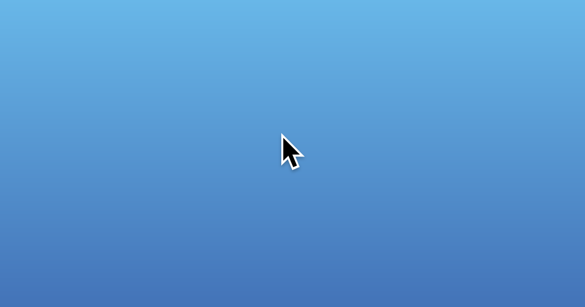

# mousecursors

Visual reference of every CSS cursor property value at [mousecursors.dev](https://mousecursors.dev).



Created at [Screen Studio](https://screen.studio) to make sure our screen recorder properly detects every system cursor type.

## Features

- All 35 CSS cursor values on one page
- Hover any tile to preview the cursor style
- Clean, responsive grid layout

## Stack

Next.js, TypeScript, styled-components

## Development

```
corepack enable
yarn install
yarn dev
```

## License

MIT
